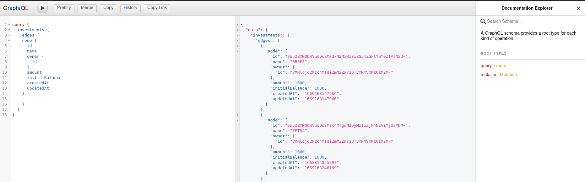

# Investment APP

This is an simple GraphQL + Relay API. If you want to learn more about relay, please visit it [docs](https://www.relay.dev). I have also implemented AUTH with JWT and email notification for new users.

## Techs
- MongoDB
- NodeJS
- Relay
- Graphql
- Nodemailer
- Dataloaders

## Setup
To run this application, you need to fill out your .env file following everything that .env.example has. After that simple run yarn dev and your server will be up at `localhost:9000/graphql`

## Why I choose this Tech.
I Love GraphQL and the possibilites of it. It's so flexible and fast, the fact that you can decide which resources you get instead of everything like a REST API. Also I choose Relay patterns because you can add paginations and the concept of [Node]() that's fantastic. Specially when developing your frontend using Relay Modern. MongoDB is a daily basis @ my life, when I don't want to create a fully db structure and also don't know exactly if my data will remain as it is.

## Documentation
GraphQL APIS has their own docs, so if you do not know what you can do with it, simple seek for here on the top right of the test environment

