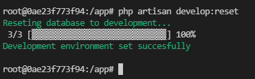
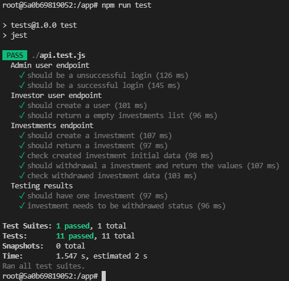

# Back-End Engineer Technical Test Project

These is a technical test for CodeRockr Back-End Engineer.

## Considerations

### About the used technology (Why i used Laravel/PHP and Jest/Node.JS for tests)

In a few words: I care about the code maintenance. 
This is not a very complex project. Just it. And by another way
LAMP is the most common web setup i ever seen and this makes easy to found
someone to work with this project.

#### Laravel/PHP

Laravel and PHP is a very solid technology, it's easy to found someone to
maintain the source code. If you are thinking about PHP are slower, you just
make it wrong. The right way to implement the hard work/complex proccess
is to implement microservices using a compiled language with RPC like interface.

#### Jest/Node.JS

I used Jest/Node.JS to make easy for the Front-End make changes on the API.
If the Front-End needs something new, he can write the endpoints and can 
send it to the Back-End to develop as fast as we can.

#### MySQL

Easy to setup, any Laravel coder can handle this easily with 
Eloquent/Migrations/Seeds/Fakes and PHPMyAdmin.

## Development roadmap

1. First, we need to setup our development stack. I'll start 
setting up VS Code Devcontainer for an easy and shared 
(shared between collaborator's) development setup.

2. Setup a REST API Tests, for TDD. I'll use Jest/Node.JS to
make cross-side API Development with the Front-End Engineer.

3. Setup Laravel 9 and start coding. 

## Setup for development

1. Open root project folder on VS Code (that contains src, test and this README.md file)
2. Press F1, run ">Remote-Containers: Reopen in Container"
3. Open terminal in container
4. Run:

    cd app

    composer install

    php artisan develop:reset

And you will get the terminal like the example below:

## Testing

To test the application, you need to go to the "tests" folder and run "npm i" and after "npm run test".
If the server hostname is wrong, you need to change it on the code.
If you cannot had Node.JS installed, use VS Code Devcontainer (described on Setup for development).
If the tests are successful, you get a terminal like below:

## Deploy instructions with source code

1. Copy the source code to the server
2. Configure the website root (DocumentRoot on Apache) to "src/public/" folder (example for apache on .devcontainer/sites.conf)
3. Configure Laravel environment
    - APP_KEY
        - Generate the Laravel key with "php artisan key:generate"
        - Ex: base64:JJgFsfditj9eqr5859085pokasdfOHo=
    - APP_URL
        - Website domain
        - Ex: https://www.google.com
    - DB_DATABASE
        - MySQL Connection string
        - Ex: mysql://localhost:3306/
    - DB_USERNAME
        - MySQL Username
        - Ex: admin
    - DB_PASSWORD
        - MySQL Password
        - Ex: 123
4. Run "composer install"
5. Run "php artisan migrate"
6. Run "php artisan user:admin:create ${username} ${password}" to create admin to be used with API
7. Run tests to check if anything is running well

# Help

1. I'm using "php artisan make\:\$something", it creates the specified\, but i get "BadMethodCallException\: Method ${class} does not exist":
- Do "composer dump-autoload"

2. I get "Warning: require(/app/public/../vendor/autoload.php): Failed to open stream: No such file or directory in /app/public/index.php on line 34" on deploy/testing:
- Do "composer install"