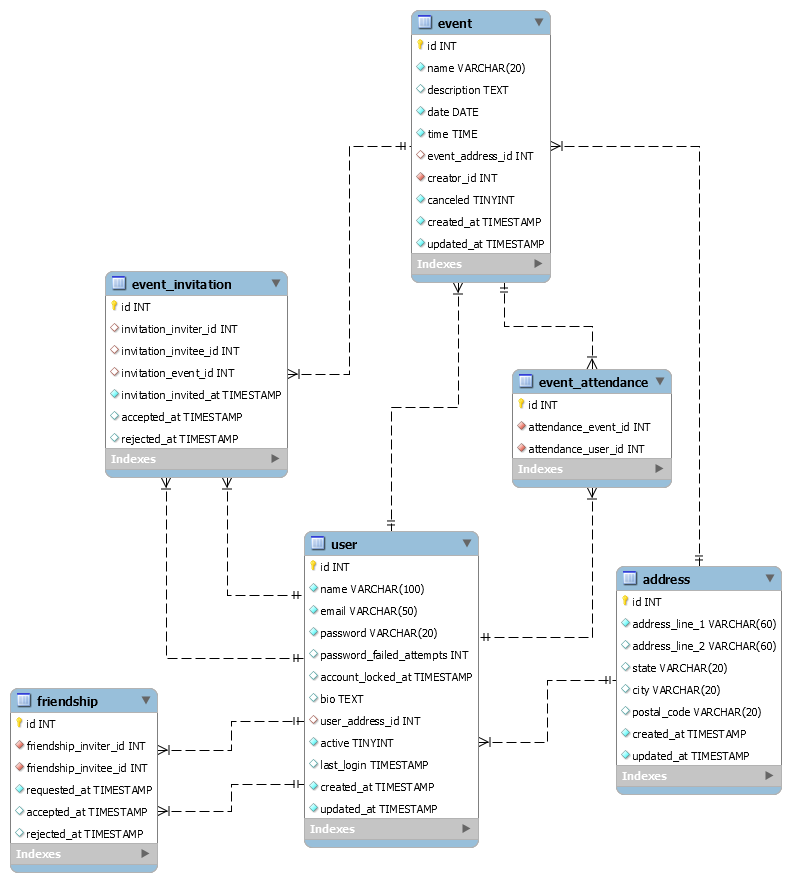

# Event Manager API

## Scope
This is an API of an application such as a social event network that implements the following features:

### Public section

- List of events
    - When accessing the `/event` route, the application shows a list of all the events registered, paging them every 10 events;
        - `GET /event`
    - The user should be able to filter the list of events by date and/or state;
        - `GET /event?date={date}`
        - `GET /event?state={state}`
        - `GET /event?date={date}&state={state}`
    
- Event details
    - When accessing the `/event/{id}` route, the application allows the user to see the details of the event;
        - `GET /event/{id}`
    
- User signup (*to be implemented*)
- User login (*to be implemented*)

### Logged-in section (*to be implemented*)

- Friend invitation
- Add as friend
- Friendship management
- Event registration
- My event list
- Manage event invitations
- Events management

## Data model

The main database used for this project is MySQL.

### ERD:

## Development environment setup

One of the ways to build and run the application is by using the development environment [XAMPP](https://www.apachefriends.org/index.html).
__Note that the application is written in PHP 8, so we need to download the XAMPP's latest version__.

- Install [XAMPP](https://www.apachefriends.org/index.html).
- Install [composer](https://getcomposer.org/) to manage the dependencies.
- Clone this repository under the _htdocs_ folder, which is inside the folder where you installed your XAMPP copy.
- Run `composer install` inside this folder.
- Start the servers (Apache and MySQL) through the XAMPP control panel.
- Access the application at `localhost:<port>/<project-folder>/api`. You might wish to configure a virtual host or ports for your environment. For more information, you can visit [XAMPP's FAQ](https://www.apachefriends.org/faq_windows.html) or searching on StackOverflow.
- There are some composer scripts that will help development:
    - `composer create-db` creates the database with all tables.
    - `composer create-indexes` creates the indexes for db tables to optimize its queries.
    - `composer populate-db-dev` populates the database with mocked data to facilitate development.
    - `composer test` runs the tests.
    - `composer test:coverage` runs the tests and generates the coverage files (found in /coverage).
    
## Third-party packages

P.S.: the project is written in PHP 8.0, so all packages are using the latest version (as of the date of writing this file).

- `slim/slim` used for routing
- `slim/psr7` used for routing and basics
- `php-di/slim-bridge` used for management of dependency injection
- `laminas/laminas-db` used for database manipulation
- `laminas/laminas-paginator` used for pagination
- `laminas/laminas-servicemanager` used to handle services used by the paginator
- `phpunit/phpunit` used for writing tests